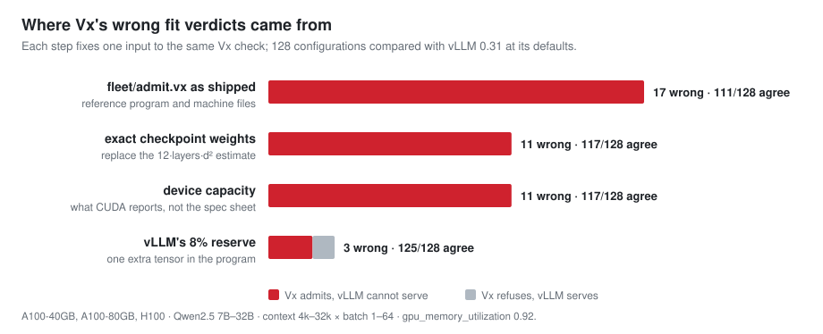
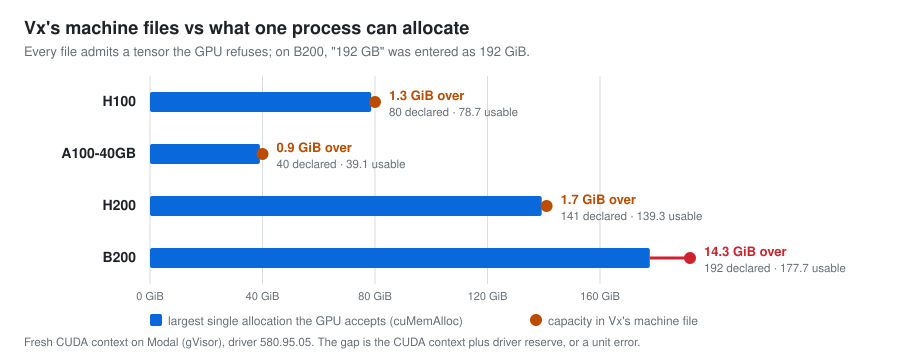
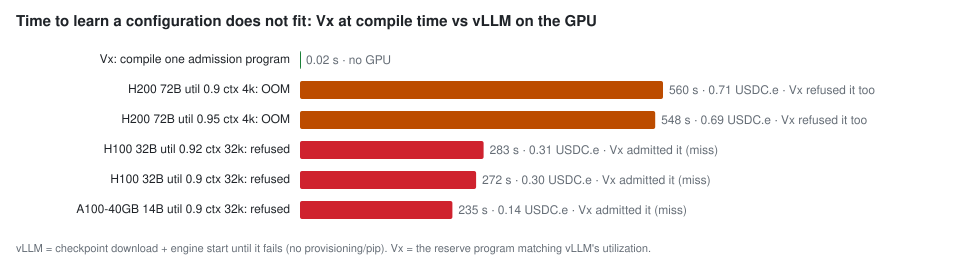

# vx-fit

[Vx](https://github.com/vx-lang/Vx) checks at compile time whether a program's tensors fit in GPU memory. This
experiment tests that check against three references: vLLM on rented GPUs, the GPUs themselves, and the code Vx
generates. Five GPUs (H100, A100-80GB, A100-40GB, H200, B200), Qwen2.5 7B–72B, October 2026.

## Findings

**1. Vx's arithmetic is exact. Its wrong answers came from its inputs.** Against vLLM 0.31 at its defaults,
the reference admission program shipped with Vx agrees on 111 of 128 configurations. Fixing the inputs, one at
a time, takes that to 125: real checkpoint sizes instead of a formula, and vLLM's 8% reserve written into the
program as one extra tensor. Of the three left, two come from vLLM's runtime memory (1.7–5.5 GiB per GPU), which
a static program cannot know without measuring it. The third is a false refusal: the program's activation estimate
is too large.



**2. Vx's machine files overstate what a process can allocate.** On every GPU, a tensor 2 MiB larger than the
largest allocation the device accepts still passes the check. On B200, a "192 GB" device was declared as 192 GiB,
14 GiB more than exists.



**3. Vx answers in 0.02 s; vLLM needs minutes of GPU time to say no.** When the Vx program encodes vLLM's
policy, it catches the out-of-memory cases before anything runs. It misses the largest model at exactly 32k
tokens, where vLLM's runtime memory decides.



**4. At its edges, the checker admits programs that do not fit.** Sibling blocks, loops, `continue`/`break`/early
`return`, escape by assignment, recursion and tiles held across calls are all handled correctly. Two classes of
program are unsound: sub-byte element types and shapes that overflow.

| program (4 MiB space) | Vx counts | generated code allocates |
|---|---:|---:|
| `Tensor<bool, [6291456]>` | 786,432 B | 6,291,456 B |
| `Tensor<i4, [6291456]>` | 3,145,728 B | 6,291,456 B |
| `Tensor<f32, [2³⁰, 2³⁰, 4]>` | warning only (W1029) | 0 B (wrapped) |

Filed upstream: [#1202](https://github.com/vx-lang/Vx/issues/1202), [#1203](https://github.com/vx-lang/Vx/issues/1203),
[#1204](https://github.com/vx-lang/Vx/issues/1204), [#1205](https://github.com/vx-lang/Vx/issues/1205),
[#1206](https://github.com/vx-lang/Vx/issues/1206). Pilot data for Vx's planned campaign: [#289](https://github.com/vx-lang/Vx/issues/289#issuecomment-5997744142).

## What this says about Vx

A calculator gives the same fit number, so the arithmetic isn't where Vx earns its keep. Vx is useful because the
check is attached to the code: it is computed from the program's own tensor types, re-runs on every change, and
follows lifetimes, calls and memory spaces that a calculator never sees. It is a static check, not a proof, and it
is only as accurate as its machine files. Serving an LLM is the case where Vx adds least. Kernel tiles in on-chip
memory and multi-stage pipelines are where it should add most.

## Run

Requires Rust, LLVM 22, Z3, CMake and Python 3.10+. New GPU measurements also need
[Fission](https://github.com/figtracer/fission) and a funded Tempo wallet.

```sh
git clone --recurse-submodules https://github.com/figtracer/vx-fit.git
cd vx-fit
(cd Vx && ./setup.sh && source config.local && cargo build --locked --bin vxc -p vxc)
python3 edges.py                                     # checker edge cases, no GPU
python3 fit.py table && python3 figures.py           # tables and figures from committed measurements
python3 fit.py measure H100 --utils 0.9 0.95 --tag=-new --approve    # rent one GPU, run vLLM
python3 fit.py probe H100 --approve                  # measure allocatable memory on one GPU
```

`measure` and `probe` only print a quote without `--approve`. Measurements are committed in `measurements/`;
failed lab runs are in `measurements/lab-failures/`. Generated Vx programs and tables go to `results/`.

## Method

- **vLLM:** each model starts at `max_model_len` 4096 and several `gpu_memory_utilization` settings, and must
  generate text. A configuration (context × batch) fits if its tokens fit the KV cache vLLM allocated. Boundary
  models also run one real 32k-token prompt.
- **Vx:** weights, KV cache and activations placed in `Memory::HBM`, as in Vx's `fleet/admit.vx`, admitted
  against the pinned machine files. Variants replace one input each: checkpoint sizes, device capacity, and an
  engine reserve tensor.
- **Hardware:** `probe.py` uses the CUDA driver API (`cuMemGetInfo`, then a binary search on `cuMemAlloc`).
- **Edges:** `edges.py` compares each verdict and byte count with the allocation in Vx's emitted LLVM.

## Limits

- vLLM's allocated KV cache and real prompts are the reference; concurrency was not driven to saturation.
- Modal sandboxes under gVisor, not bare metal; one GPU per run, no tensor parallelism.
- The image has no `nvcc`: FlashInfer's sampler is disabled, `gcc` is installed for torch.compile, and B200 uses
  Triton attention. The A100-80GB allocation probe failed under gVisor; its capacity comes from vLLM.
- vLLM 0.31's default utilization is 0.92. Runs that did not set it are labelled 0.92.
- Measured against Vx 42ada79. The code and machine files behind each finding are unchanged on main (0dd89a4).
